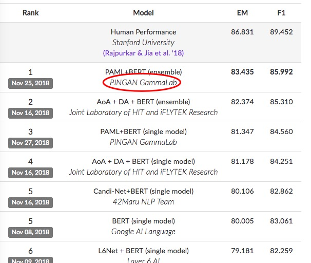

## Introduction
During my internship at GammaLab, I participated in the SQUAD competition with team and won the first place in the world.  [https://rajpurkar.github.io/SQuAD-explorer/](https://rajpurkar.github.io/SQuAD-explorer/)  
This project is an exploration of Chinese machine reading comprehension and also a summary of my internship work.




## Dependencies
Tensorflow 1.7  
tqdm  
jieba  
synonym  

## Dataset
Dureader   [http://ai.baidu.com/broad/subordinate?dataset=dureader](http://ai.baidu.com/broad/subordinate?dataset=dureader)  
Sogou   [http://task.www.sogou.com/cips-sogou_qa/](http://task.www.sogou.com/cips-sogou_qa/)  
CMRC 2017  [https://hfl-rc.github.io/cmrc2017/](https://hfl-rc.github.io/cmrc2017/)  

## Mission Details
`Paragraph`:
胰腺移植：指因胰腺功能衰竭，已经实施了在全身麻醉下进行的胰腺的异体器官移植手术。__单纯胰岛移植、部分胰腺组织或细胞的移植__ 不在本保障范围之内。  
`Question`: 哪些移植不在胰腺移植的保障范围呢？  
`Answer`: 单纯胰岛移植、部分胰腺组织或细胞的移植
```python
{'title': '',
'paragraphs': [{'context':
'地方税务局是一个泛称，是中华人民共和国1994年分税制改革的结果。1994年分税制把税种分为中央税、地方税、中央地方共享税；把
征税系统由税务局分为国家税务系统与地方税务系统。其中中央税、中央地方共享税由国税系统（包括国家税务总局及各地的国家税务局
）征收，地方税由地方税务局征收。地方税务局在省、市、县、区各级地方政府中设置，国务院中没有地方税务局。地税局长由本级人民
政府任免，但要征求上级国家税务局的意见。一般情况下，地方税务局与财政厅（局）是分立的，不是一个机构两块牌子。但也有例外，
例如，上海市在2008年政府机构改革之前，上海市财政局、上海市地方税务局和上海市国家税务局为合署办公，一个机构、三块牌子，
而2008年政府机构改革之后，上海市财政局被独立设置，上海市地方税务局和上海市国家税务局仍为合署办公，一个机构、两块牌子。同
时县一级，财政局长常常兼任地税局长。地方税务局主要征收：营业税、企业所得税、个人所得税、土地增值税、城镇土地使用税、城市
维护建设税、房产税、城市房地产税、车船使用税、车辆使用牌照税、屠宰税、资源税、固定资产投资方向调节税、印花税、农业税、农
业特产税、契税、耕地占用税、筵席税，城市集体服务事业费、文化事业建设费、教育费附加以及地方税的滞补罚收入和外商投资企业土
地使用费。',
'segmented_context': ['地方税务局', '是', '一个', '泛称', '，', '是', '中华人民共和国', '1994', '年', '分税
制', '改革', '的', '结果', '。', '1994', '年', '分税制', '把', '税种', '分为', '中央税', '、', '地方税', '
、', '中央', '地方', '共享税', '；', '把', '征税', '系统', '由', '税务局', '分为', '国家', '税务系统', '与', '
地方', '税务系统', '。', '其中', '中央税', '、', '中央', '地方', '共享税', '由', '国税', '系统', '（', '包
括', '国家税务总局', '及', '各地', '的', '国家税务局', '）', '征收', '，', '地方税', '由', '地方税务局', '征
收', '。', '地方税务局', '在', '省', '、', '市', '、', '县', '、', '区', '各级', '地方', '政府', '中', '设
置', '，', '国务院', '中', '没有', '地方税务局', '。', '地税局', '长由', '本级', '人民政府', '任免', '，', '
但', '要', '征求', '上级', '国家税务局', '的', '意见', '。', '一般', '情况', '下', '，', '地方税务局', '与', '
财政厅', '（', '局', '）', '是', '分立', '的', '，', '不是', '一个', '机构', '两块', '牌子', '。', '但', '
也', '有', '例外', '，', '例如', '，', '上海市', '在', '2008', '年', '政府', '机构', '改革', '之前', '，', '
上海市', '财政局', '、', '上海市', '地方税务局', '和', '上海市', '国家税务局', '为', '合署', '办公', '，', '一
个', '机构', '、', '三块', '牌子', '，', '而', '2008', '年', '政府', '机构', '改革', '之后', '，', '上海
市', '财政局', '被', '独立设置', '，', '上海市', '地方税务局', '和', '上海市', '国家税务局', '仍为', '合署', '
办公', '，', '一个', '机构', '、', '两块', '牌子', '。', '同时', '县', '一级', '，', '财政', '局长', '常常',
'兼任', '地税局', '长', '。', '地方税务局', '主要', '征收', '：', '营业税', '、', '企业', '所得税', '、', '个
人所得税', '、', '土地', '增值税', '、', '城镇', '土地', '使用税', '、', '城市', '维护', '建设', '税', '、', '
房产税', '、', '城市', '房地产', '税', '、', '车船', '使用税', '、', '车辆', '使用', '牌照税', '、', '屠宰
税', '、', '资源税', '、', '固定资产', '投资', '方向', '调节税', '、', '印花税', '、', '农业税', '、', '农
业', '特产税', '、', '契税', '、', '耕地', '占用', '税', '、', '筵席', '税', '，', '城市', '集体', '服务', '
事业费', '、', '文化', '事业', '建设费', '、', '教育费', '附加', '以及', '地方税', '的', '滞', '补罚', '收
入', '和', '外商投资', '企业', '土地', '使用费', '。'],
'qas':
[{'question': '地税局长由哪个机构任免？',
  'segmented_question': ['地税局', '长由', '哪个', '机构', '任免', '？'],
  'answers': [{'text': '本级人民政府', 'answer_span': [86, 87]}],
  'id': 174411}]}]}
```

## Performance
通用MRC|Dev EM|Dev F1|Test EM|Test F1|step
----|----|----|----|----|---
QANet96|49.25|76.82|41.93|73.68|88000
QANet256|48.57|76.46|42.04|73.80|100000
QANet256+cw2vec*|47.42|77.05|47.18|75.42|57000
QANet256+stroke-aware*|47.79|77.07|47.62|76.44|59000
QANet256+wordpiece-aware*|-|-|-|-|-
BERT-base|46.58|75.94|46.34|76.12|100000

>cw2vec: Learning Chinese Word Embeddings with Stroke n-gram Information  
stroke-aware: Original method   
wordpiece-aware: Original method

## Analysis


## TODO
- [x] Update README.MD
- [x] Update QANetBaseline
- [ ] Update cw2vec
- [ ] Update stroke-aware language model
- [x] Update wordpiece-aware language model
- [ ] Bert-Chinese 
- [ ] Update Question Augument:FrameNet + Open-sesame + Valencer
